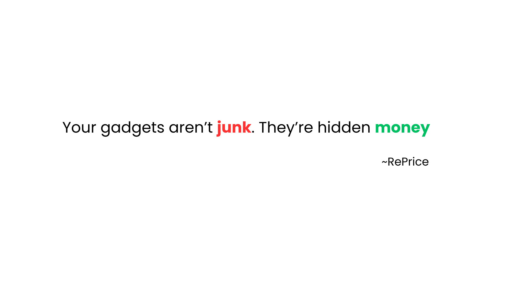
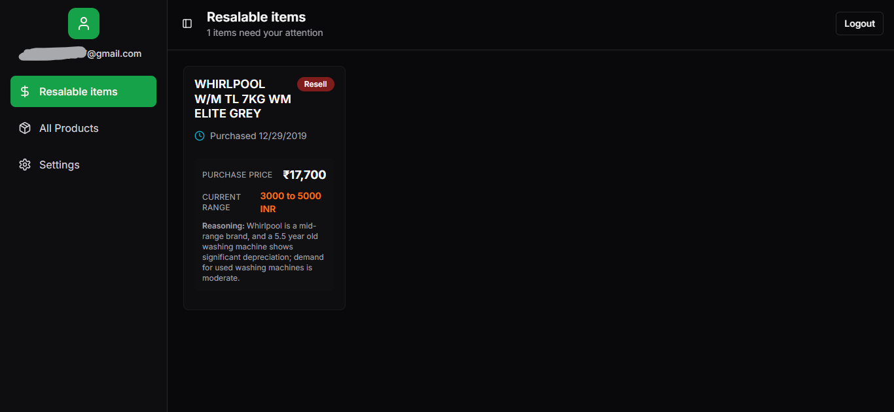
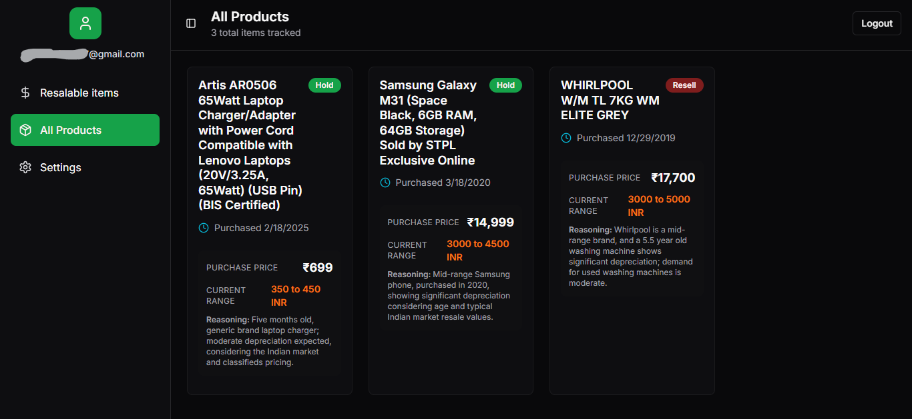
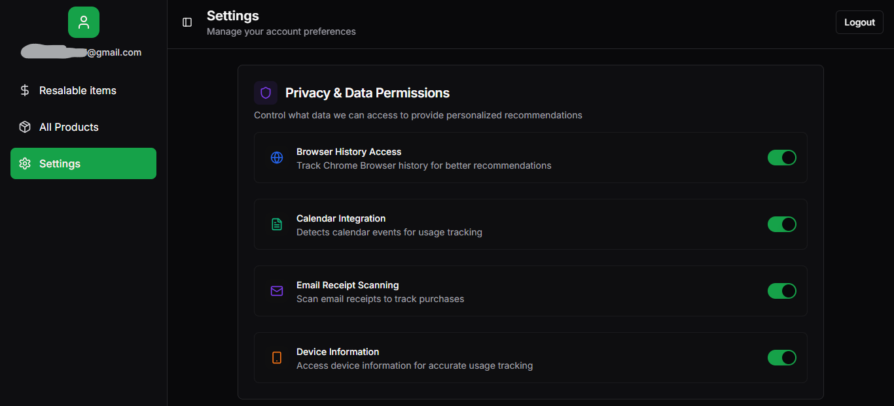
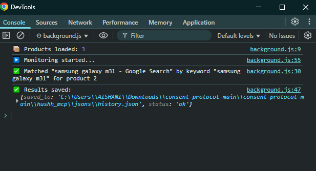

# 📦 Personal Economy Agent (RePrice)


## 🚀 What is it?

The **Personal Economy Agent** is your AI-powered assistant that helps you unlock hidden value from your gadgets. Most of us buy electronics like phones, headphones, webcams, or laptops — but after a while, they sit unused in drawers, even though they still have resale value.

This project automatically tracks your electronic purchases, checks whether they’re still being used, and estimates their **realistic resale value** today. All data is kept private and encrypted in your **Hushh Vault**, with full user consent managed through the **Hushh MCP protocol**.

---

## 💡 Why is it useful?

* People forget about the **resale value of their old gadgets**.
* Traditional expense trackers only tell you what you spent — not what you can still earn back.
* With this system, your electronics become a **“hidden wallet”** — money you can recover anytime.
* Runs with **data security at the core** thanks to Hushh MCP.

---

## ✨ Key Features

* **Email Receipt Extraction** → Reads purchase invoices from Gmail/Outlook (Amazon, Flipkart, Croma, etc.) to identify item, price, purchase date, and platform.
* **Usage Detection (multi-signal)** →

  * **Calendar mentions** (e.g., meetings with "Zoom webcam" hint).
  * **Browser history** (e.g., searches like *“how to fix headphones not charging”* or *“buy new mouse”*).
  * **Driver/Device metadata** (e.g., was this webcam connected to the system recently? Battery check for headphones?).
* **Valuation Agent** → Estimates realistic resale prices based on category, age, and market trends in India.
* **Resale Deals Dashboard** → A simple dashboard that shows all your gadgets with their current resale values.
* **Privacy by Design** → All personal data is stored encrypted in the **Hushh Vault** with full user consent managed by the MCP protocol.

---

## ⚙️ How it Works (Step by Step)

1. **Receipt Agent** scans your emails daily → extracts product name, purchase date, price, and platform.
2. Data is stored in the **Hushh Vault** securely with user consent.
3. **Usage Agent** combines multiple signals:

   * Looks for related searches in **browser history**.
   * Checks **OS driver/device metadata** to see if the product was connected recently.
   * Scans **calendar events** for mentions of that device.
     Together, these signals form a picture of whether the product is *active, inactive, or uncertain*.
4. **Valuation Agent** calculates the resale value using depreciation logic + GPT reasoning.
5. **Resale Deals Agent** compiles all active items with their updated resale values and shows them in the dashboard.

---

## 🔐 Trust & Privacy

This project integrates the **Hushh MCP Protocol** for:

* **Consent Management** → User decides what data can be read.
* **Vault Encryption** → All personal data stays private and encrypted.

---

## 🖥️ Example Use Case

* You bought a Logitech webcam in 2023.
* The system sees **no recent Zoom calendar meetings**, **no browser searches about webcam use**, and **no driver connection for 2 months**.
* It classifies the webcam as “inactive” and estimates resale at ₹2200.
* On the dashboard, you see this resale deal and can decide whether to sell or keep.

---

👉 With this, your gadgets stop being “forgotten junk” and start becoming **hidden cash you can unlock anytime**.

---

## Diagram of the project


### Few pictures








## Agent names functionality
```
├── hushh_mcp/                  
│   ├── agents/                 # AI agents
│   │   ├── aggregator_agent.py         # Consolidates all the data from the available json files
│   │   ├── calender_reader_agent.py    # Gets data from google calendar and saves it in the calendar_lastseen.json
│   │   ├── context_agent.py            # Generates context for each products
│   │   ├── cost_agent.py               # Tells resale value of each product
│   │   ├── gmail_reader_agent.py       # Reads gmail and extracts relevant emails
│   │   ├── receipt_agent.py            # Extracts relevant data from relevant emails
│   │   └── usage_agent.py              # Decides whether the product is resell candidate|dont sell|uncertain
│   │
│   ├── jsons/                 # JSON outputs (data storage)
│   └── vault/                  # Vault
│       ├── encrypt.py
│       └── json_vault.py       # contains functions which is used to make encryption vault
│
├── tests/                      # Unit tests
│   ├── test_agents.py
│   ├── test_aggregator_agent.py
│   ├── test_calender_reader_agent.py
│   ├── test_context_agent.py
│   ├── test_cost_agent.py
│   ├── test_gmail_reader_agent.py
│   ├── test_receipt_agent.py
│   ├── test_usage_agent.py
│   └── test_vault.py
```

## How to run this project

### Setup the ENV variables (imp)
```
# Server port (optional if not running web server)
PORT=3000

# 🔐 HMAC signing key (64-character hex, 256-bit)
SECRET_KEY=your_64_char_hex_here

# 🔒 Vault AES encryption key (64-character hex, 256-bit)
VAULT_ENCRYPTION_KEY=your_64_char_hex_here

# ⏱️ Expiration durations (milliseconds)
DEFAULT_CONSENT_TOKEN_EXPIRY_MS=604800000
DEFAULT_TRUST_LINK_EXPIRY_MS=2592000000

# 🌱 App context
ENVIRONMENT=development
AGENT_ID=agent_hushh_local
HUSHH_HACKATHON=enabled

GROQ_API_KEY=your_key
GEMINI_API_KEY=your_key

OAUTHLIB_INSECURE_TRANSPORT=1

FLASK_SECRET_KEY=your_64_char_hex_here
```

**If you want to run the backend proccesses, or the agents for your own account then you have to delete files inside ```jsons``` most importantly delete** ```usage.json```. **The whole pipeline of agents run automatically after 7 days.**


To run frontend

```
cd frontend
npm install
npm run dev
```

To run the flask server

```
pip install -r requirements.txt
python -m hushh_mcp.server
```

To run the chrome extension

- Open ```chrome://extensions/```
- Turn on developer mode
- select the folder ```hushh_mcp/chrome-extension```
- Do it after running the script
- click on the extension and click ```start monitoring```
- Thats it!


